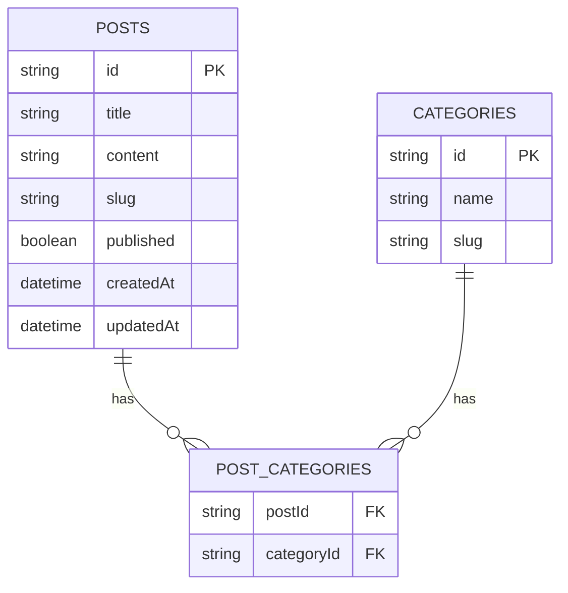

# Blogging Platform Assessment

A full-stack blogging platform built with Next.js 15, PostgreSQL, and modern web technologies as part of a technical assessment.

## 🚀 Features

### 🔴 Core Features (Priority 1)
- [] Blog post CRUD operations
- [] Category management
- [] Many-to-many post-category relationships
- [] Blog listing with category filtering
- [] Individual post view pages
- [] Responsive navigation
- [] Clean, professional UI

### 🟡 Enhanced Features (Priority 2)
- [] Dashboard for content management
- [] Draft vs Published post status
- [] Loading and error states
- [] Mobile-responsive design
- [] Markdown content editor

### 🟢 Bonus Features (Priority 3)
- [] Post preview
- [] Pagination

## 🛠️ Tech Stack

- **Frontend**: Next.js 15 (App Router), React 18, TypeScript
- **Styling**: Tailwind CSS, shadcn/ui
- **State Management**: Zustand, React Query
- **API**: tRPC with Zod validation
- **Database**: PostgreSQL with Drizzle ORM
- **Deployment**: Vercel

## 🏗️ Project Structure

```
app/               # App Router pages
components/        # Reusable UI components
src/
├── db/                # Database schema and client
├── server/            # tRPC routers and API logic
└── store/            # store for db
```

## 🚀 Getting Started

### Prerequisites

- Node.js 18+
- PostgreSQL 14+
- npm 

### Local Development

1. Clone the repository:
   ```bash
   git clone https://github.com/IshitaKhandelwal2005/blogging_platform.git
   cd blogging_platform
   ```

2. Install dependencies:
   ```bash
   npm install
   ```

3. Set up environment variables:
   ```bash
   cp .env.example .env.local
   # Update the .env.local with your database credentials
   ```

4. Set up the database:
   ```bash
   # Run migrations
   npx drizzle-kit push:pg
   
   # Seed with sample data
   npx tsx scripts/seed.ts
   ```

5. Start the development server:
   ```bash
   npm run dev
   ```

## 📊 Database Schema



## 🏗️ Architecture Decisions

### tRPC Structure
- **Routers**:
  - `post.router.ts`: All post-related operations
  - `category.router.ts`: Category management
  - `app.router.ts`: Combines all routers

### Key Decisions
1. **Markdown over Rich Text**: Chose markdown for faster implementation
2. **shadcn/ui**: Used for pre-built, accessible components
3. **No Authentication**: Focused on core features as per requirements
4. **Optimistic Updates**: Implemented for better UX

## 🧪 Testing

Run tests:
```bash
npm test
```

Run tests with coverage:
```bash
npm run test:coverage
```

## 🌐 Live Demo

(https://blogging-platform-f60j58lb0-ishitas-projects-cdb5fa95.vercel.app/)
